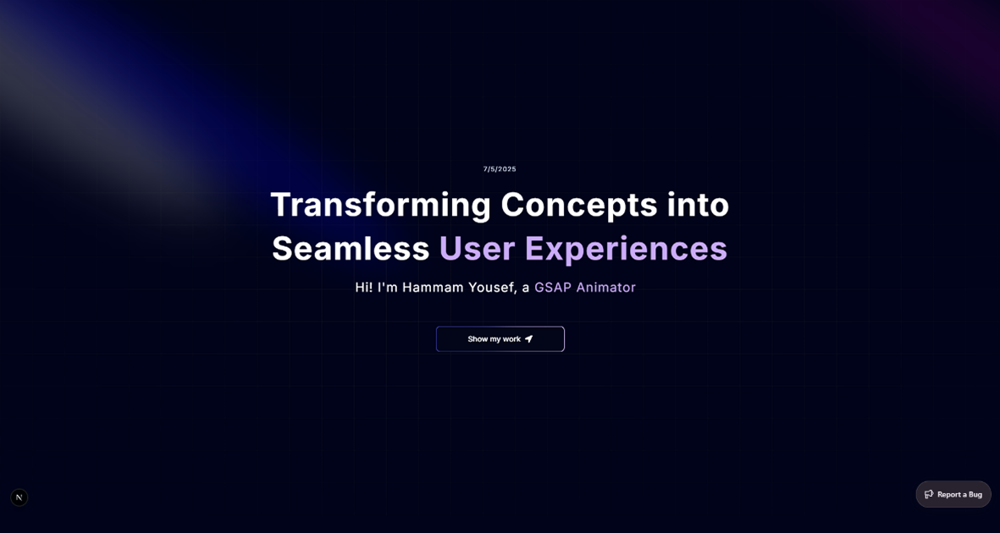

# 🧑‍💻 Hammam Yousef — Portfolio

A modern and interactive developer portfolio built with **Next.js 15 (App Router)**, **TypeScript**, **Tailwind CSS v4**, and **GSAP animations**.  
It showcases my full-stack projects, technical skills, work experience, and approach — all wrapped in a sleek, responsive design.



---

## 🚀 Tech Stack

| Category     | Technologies |
|--------------|--------------|
| **Frontend** | Next.js 15, React, TypeScript, Tailwind CSS, Shadcn UI |
| **Animation**| GSAP, Framer Motion |
| **CMS (Project)** | Sanity |
| **Auth (Project)**| NextAuth.js (GitHub OAuth) |
| **Tools**    | Vercel, GitHub, Postman, VS Code |

---

## 📸 Live Demo

🔗 [Visit Portfolio](https://portfolio-chi-livid-76.vercel.app/)  
📷 Includes OG image support, smooth transitions, and dynamic flipping words in the hero section.

---

## 📂 Project Structure

app/
  └─ layout.tsx         # Global layout + metadata
  └─ page.tsx           # Homepage (hero, sections, etc.)
  └─ components/        # Reusable components (skills, projects, etc.)
  └─ constants/         # Tech stacks, social links, data arrays
  └─ public/            # Static assets (images, og-image, icons)

---

## ✨ Features

- 🔁 **Hero Flip Animation** with dynamic role rotation (Full Stack, React Dev, GSAP Animator…)
- 🧠 **Projects Section** with live previews and tech stacks
- 💼 **Experience Timeline** (ASAL Internship, BWS Certificate, etc.)
- 🎯 **Skills Grid** with icons and category tabs
- ⚙️ Fully **responsive** and **dark-themed**
- 🖼️ Optimized with Open Graph + Twitter metadata
- 📦 Lazy loaded sections for better performance

---

## 📜 Certificates & Badges

- ✅ **BWS Full Stack Internship Certificate** (Apr 2025 – Aug 2025)
- ✅ **ASAL Frontend Development Intern** (Nov 2024 – Feb 2025)
- ✅ **Full Stack Bootcamp (2023–2024)**

---

## 🛠️ Running Locally

```bash
git clone https://github.com/HammamYousef/your-portfolio-repo.git
cd your-portfolio-repo
npm install
npm run dev
```

Visit `http://localhost:3000`

---

## 📧 Contact

- Email: eng.hammam.yousef@gmail.com  
- LinkedIn: [linkedin.com/in/hammam-yousef](https://www.linkedin.com/in/hammam-yousef-7029a82a8/)  
- GitHub: [github.com/HammamYousef](https://github.com/HammamYousef)

---

## 📄 License

This project is open-source and available under the [MIT License](LICENSE).

